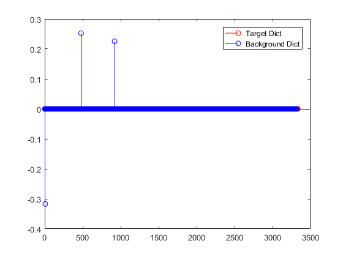
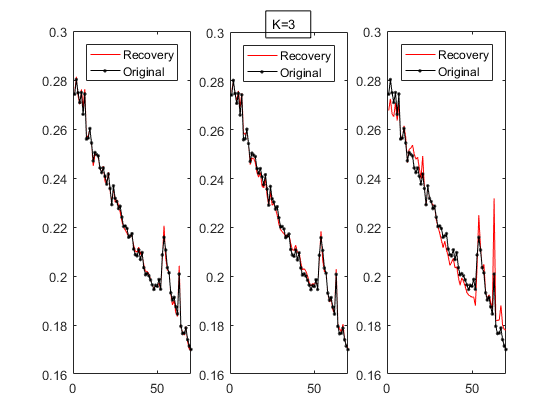
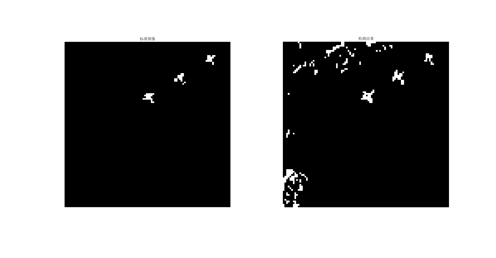
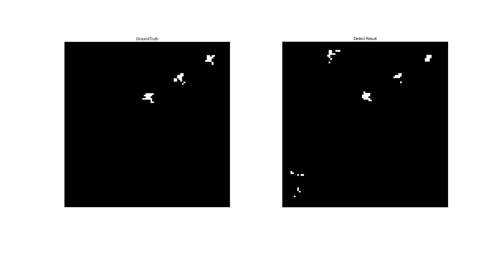
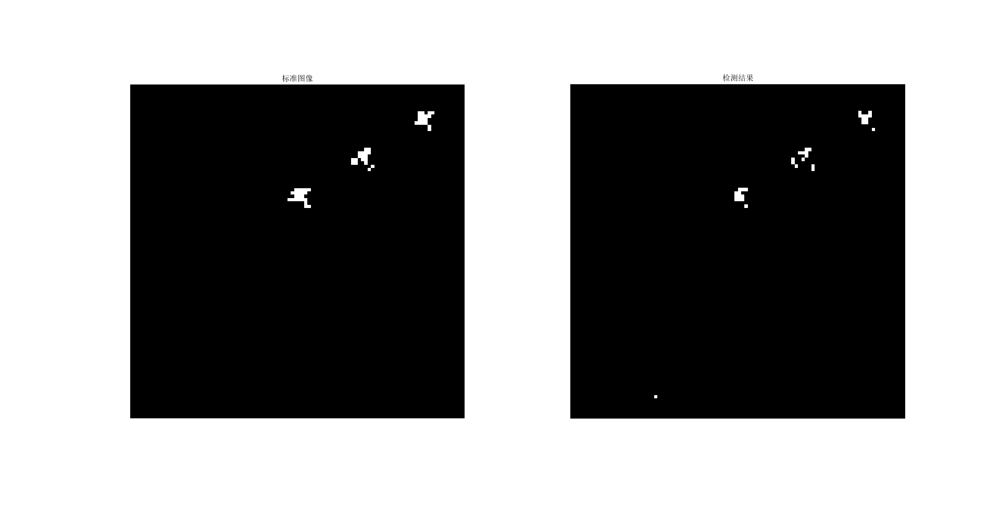
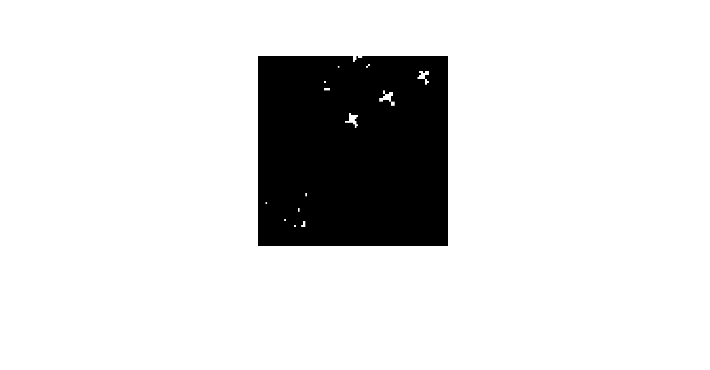
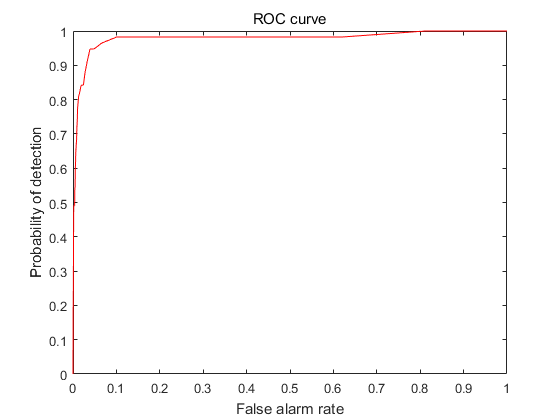
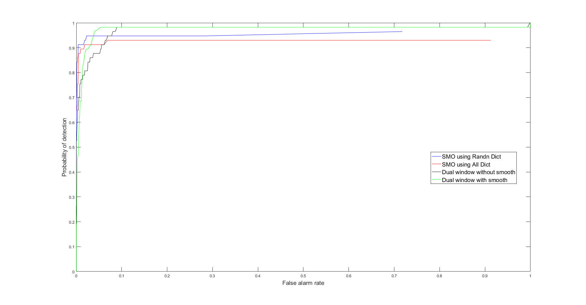

## Introduction

Hyperspectral image target detection based on [sparse representation](https://en.wikipedia.org/wiki/Sparse_approximation),an effective method in Pattern Recognition.  Target detection
aims to separate the specific target pixel from the various backgrounds by the use of known target
pixels or anomalous properties.
The proposed approach relies on the binary hypothesis model of an unknown sample induced by sparse representation.
The sample can be sparsely represented by training samples from the background and target dictionary. The sparse vector
in the model can be recovered by a greedy algorithm [OMP](https://en.wikipedia.org/wiki/Matching_pursuit) .

## Author
  * [@ShoupingShan](https://github.com/ShoupingShan)

##   Bibliography

 1. **[Sub-space Matching](http://ieeexplore.ieee.org/abstract/document/5766028/)**
    
     *Chen Y, Nasrabadi N M, Tran T D. Hyperspectral image classification using dictionary-based sparse representation[J]. IEEE Transactions on Geoscience and Remote Sensing, 2011, 49(10): 3973-3985.*
 2. **[Dual Window](http://ieeexplore.ieee.org/abstract/document/5711635/)**
    
     *Chen Y, Nasrabadi N M, Tran T D. Sparse representation for target detection in hyperspectral imagery[J]. IEEE Journal of Selected Topics in Signal Processing, 2011, 5(3): 629-640.*
  

## Theory (SMSD)

The problem of target detection can be regarded as a competitive relationship of two hypotheses (Background) and (Target).

  T and B are both matrices, their column vectors are divided into target and background subspace.  and  form the coefficient vectors of the coefficients, respectively. N denotes Gaussian random noise, [T,B]represents a cascade matrix of T and B.

  Suppose ,When D is greater than a certain threshold η, then X is the target.

  That means we need to find a projection matrix p.

  By the sparse representation of knowledge, it is known that the residual error of signal reconstruction can be expressed as:

After comparison we can find:

Suppose ,When D is greater than a certain threshold η, then X is the target.

Then it is based on the ROC curve to compare different threshold effects, resulting in the final result.

However, it is better to amend Denominator as  in practice.

## Data

### San Diego hyperspectral dataset (400*400)

### GroundTruth (100*100)

## Rebuilt

  ### Sparse coefficients

  ### Rebuild by dict_b and dict_t

## Detection

### Sparse Representation

### Dual window

### Dual window with smooth

### SVM

|  |Positive|Negative|Total|Accuracy|
|:-:|:-----:|:------:|:---:|:------:|
|Train|37|6629|6666||
|Test|57|9943|10000|0.9989|

### Fisher

    1. Using all of data

|  |Positive|Negative|Total|Accuracy|
|:-:|:-----:|:------:|:---:|:------:|
|Train|57|9943|10000||
|Test|57|9943|10000|0.9926|

    2. Using part of the data

|  |Positive|Negative|Total|Accuracy|
|:-:|:-----:|:------:|:---:|:------:|
|Train|37|6629|6666||
|Test|57|9943|10000|0.985|

## ROC curve

## Platform
  * [Win10](https://www.microsoft.com/zh-cn)
  * [VS2013](http://www.iplaysoft.com/vs2013.html)
  * [OpenCV 2.4.9](http://opencv.org/)
  * [Matlab r2016b](https://www.mathworks.com/)
## How to run
  > For Sparse Representation

      mat/detect.m
  > For SVM

      svm/main.cpp
  > For Fisher_part

      fisher/fisher.cpp
  > For Fisher_all

      fisher/fisher_all.cpp
## Contact Us
  *shp395210@outlook.com*
